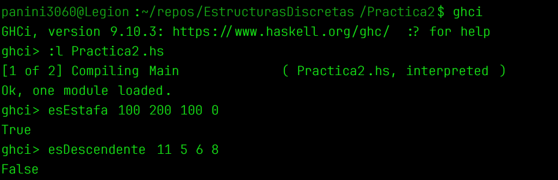

# Práctica 2: Thinking in Haskell

## Objetivo de la práctica

El objetivo de esta práctica es desarrollar funciones básicas utilizando el lenguaje de programación Haskell y poner en práctica los conceptos fundamentales de la programación funcional. A través de los ejercicios se trabajó con la definición de funciones, firmas de tipo, operaciones aritméticas, expresiones condicionales y diferentes tipos de datos.

La práctica también tiene como propósito continuar utilizando el entorno de desarrollo configurado anteriormente y familiarizarse con GHCi para cargar y probar funciones de Haskell. Además, se continúa utilizando Git y GitHub para llevar un control de versiones organizado del desarrollo de la práctica.

## Tiempo requerido

El tiempo total requerido para realizar la práctica fue de aproximadamente 3.

## Herramientas utilizadas

Durante la realización de la práctica se utilizó Fedora 44 como sistema operativo, GHC 9.10.3 como compilador de Haskell y GHCi como intérprete interactivo para cargar y probar el archivo de la práctica. Como editor de código se utilizó Emacs 30.2. También se utilizaron Git y GitHub para el control de versiones y almacenamiento del repositorio.

## Lineamientos de la práctica

Durante la implementación de las funciones se siguieron los lineamientos establecidos para la práctica. Las funciones se desarrollaron utilizando las operaciones y funciones básicas permitidas para los ejercicios, así como las estructuras condicionales necesarias.

Cada función implementada fue acompañada por un comentario que describe su propósito. También se utilizó control de versiones mediante Git, realizando un mínimo de tres commits atómicos durante el desarrollo de la práctica.

De acuerdo con los lineamientos, la práctica cuenta con este archivo `README.md`, en el que se documentan el objetivo, el tiempo requerido y los comentarios relevantes sobre el desarrollo. También se realizó la carga y ejecución del archivo `.hs` mediante GHCi y se incluye una captura de pantalla como evidencia.

## Desarrollo de la práctica

Durante la práctica se implementaron diferentes funciones en Haskell para resolver problemas relacionados con operaciones numéricas, conversiones, cálculos financieros, validaciones y geometría.

En una primera parte se desarrollaron funciones para realizar conversiones y cálculos relacionados con cashback. Se implementaron funciones para realizar una reconversión, calcular el cashback correspondiente a una cantidad y obtener el equivalente monetario de una cantidad de puntos.

Posteriormente se implementó una función para convertir una cantidad de minutos en una expresión que indique las horas y los minutos correspondientes. También se desarrollaron funciones para realizar diferentes validaciones, incluyendo la comprobación de las condiciones establecidas para determinar una estafa y la verificación de si cuatro valores se encuentran en orden descendente.

En la siguiente parte se implementó una función para calcular el índice de masa corporal a partir del peso y la altura y devolver la categoría correspondiente de acuerdo con los rangos establecidos en el ejercicio.

Finalmente, se desarrollaron funciones relacionadas con geometría. Se implementó el cálculo de la hipotenusa de un triángulo rectángulo, la pendiente de una recta a partir de dos puntos y la distancia entre dos puntos del plano cartesiano.

Todas las funciones fueron implementadas en el archivo `Practica2.hs` y cuentan con sus respectivas firmas de tipo y comentarios.

## Pruebas con GHCi

Para comprobar el funcionamiento de las funciones se utilizó GHCi. El archivo `Practica2.hs` fue cargado desde la terminal y posteriormente se realizaron diferentes pruebas para verificar los resultados obtenidos.

Entre las pruebas realizadas se encuentran el cálculo de una reconversión, el cálculo de cashback, la conversión de puntos a dinero, la conversión de minutos a horas y minutos, la comprobación de valores descendentes y el cálculo del índice de masa corporal. También se probaron las funciones correspondientes al cálculo de la hipotenusa, la pendiente y la distancia entre dos puntos.

La evidencia de la carga del archivo y de las pruebas realizadas mediante GHCi se incluye a continuación:



## Control de versiones

Durante el desarrollo de la práctica se utilizó Git para mantener un historial organizado de los cambios realizados. Se realizaron un mínimo de tres commits atómicos, procurando que cada uno representara una unidad lógica de trabajo dentro del desarrollo de la práctica.

Los commits permiten identificar las diferentes etapas de implementación de las funciones y mantener un historial de cambios claro. Una vez finalizado el desarrollo de la práctica, los commits serán sincronizados con el repositorio remoto correspondiente en GitHub.

## Comentarios, problemas y soluciones

Durante el desarrollo de la práctica fue necesario trabajar con diferentes tipos de datos de Haskell, principalmente `Int`, `Float`, `Bool` y `String`. Esto permitió reforzar el uso de firmas de tipo y comprender la forma en que Haskell maneja los diferentes tipos de datos.

Uno de los casos que requirió especial atención fue el cálculo del monto correspondiente a una cantidad de puntos de cashback, debido a que la cantidad de puntos se recibe como un `Int`, mientras que el valor de cada punto se maneja como un `Float`. Para realizar correctamente la operación fue necesario realizar la conversión correspondiente entre tipos numéricos.

También se utilizó GHCi durante el desarrollo para probar individualmente las funciones y detectar errores en sus definiciones. Esto permitió verificar los resultados de las funciones de manera interactiva.

## Estado final de la práctica

Al finalizar la práctica se implementaron las funciones solicitadas en el archivo `Practica2.hs`. Las funciones cuentan con sus respectivas firmas de tipo y comentarios, y fueron probadas mediante GHCi.

La práctica también cuenta con su documentación correspondiente mediante este archivo `README.md` y con el historial de versiones requerido mediante commits atómicos. La evidencia de las pruebas realizadas en GHCi se incluye en este mismo documento.

## Estructura de la práctica

La carpeta correspondiente a la práctica contiene el archivo con las funciones implementadas y este documento de documentación. Además, se incluye la captura de pantalla correspondiente a las pruebas realizadas mediante GHCi.

```text
Practica2/
├── Practica2.hs
├── README.md
└── [captura de GHCi]
```

